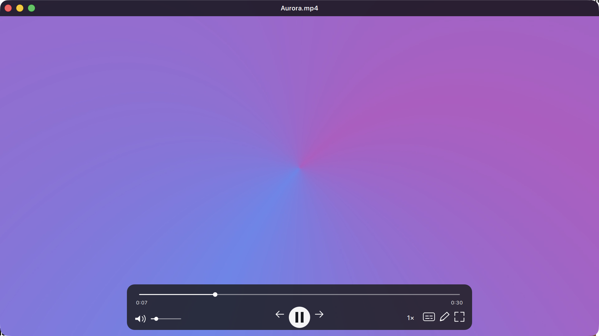

# WAM

**Wesley's Audiovisual Media Player** — a minimal, native-feeling macOS player
that's as light as QuickTime and plays the files QuickTime can't, with the
lightweight editing tasks that usually require opening a separate editor built
in.

The chrome fades while you watch — what's left is just your video.

## Why WAM

- **QuickTime-class efficiency.** On the measured 1080p baseline WAM matches
  QuickTime's CPU and energy use with exactly zero GPU work — its own process
  runs lighter than QuickTime's — so playback stays smooth even while a game
  or training run is saturating the machine, and WAM doesn't fight them for
  the GPU. ([Full methodology and tables](docs/DEVELOPING.md#measured-performance).)
- **Plays what QuickTime won't.** H.264, HEVC (8/10-bit), VP9, and AV1 decode
  natively in hardware across MP4, MOV, and MKV. Anything else falls back
  seamlessly to a bundled mpv/FFmpeg engine — no codec-pack hunting.
- **Stays out of your way.** Edge-to-edge video under a translucent title band
  and floating transport that fade while watching; aspect-exact window resize;
  double-click to fit the screen; keeps playing when unfocused, occluded, or
  backgrounded; stays open at the end so you can scrub back.
- **Quick edits without an editor.** IN/OUT trim with retimed MP4 export, and
  cancellable on-device caption generation (whisper.cpp) — captions never
  leave your machine.

## Everyday use

- Open local files, URLs, or drag-and-drop; hardware decoding with safe
  software fallback; subtitles; audio-only media
- Space to play/pause, Left/Right to seek (step is configurable), timeline
  scrubbing, volume, mute, fullscreen, caption toggle, 0.25–4× playback with
  pitch preserved
- Settings live in the native menu bar; optional "window hugs video" mode
  removes letterboxing entirely

| Action | Control |
| --- | --- |
| Open media | Command/Ctrl+O, click the empty player, or drop a file |
| Play/pause | Space |
| Seek (configurable step) | Left/Right |
| Scrub | Timeline |
| Mute and volume | Transport controls |
| Cycle common speeds | `1×` transport control |
| Fit window to screen | Double-click video or title bar |
| Fullscreen | F |
| Quick Edit | E or pencil control |
| Close Quick Edit | Escape or close control |

## Under the hood

On macOS, playback is fully native: AVFoundation demux (plus a custom Matroska
demuxer for MKV) feeds VideoToolbox hardware decode, an audio-authoritative
clock schedules frames, and decoded output is composited by WindowServer
directly — video never touches the UI toolkit's render loop. That is the same
architectural property that makes QuickTime cheap, and it's why the numbers
match. Windows and Linux builds run on the bundled mpv/FFmpeg engine.

## Building and contributing

Build instructions, benchmark harnesses, performance policy, measured
baselines, and release/signing details are in
[docs/DEVELOPING.md](docs/DEVELOPING.md). Architecture deep-dives:
[docs/ARCHITECTURE.md](docs/ARCHITECTURE.md) and
[docs/PRODUCT.md](docs/PRODUCT.md).
